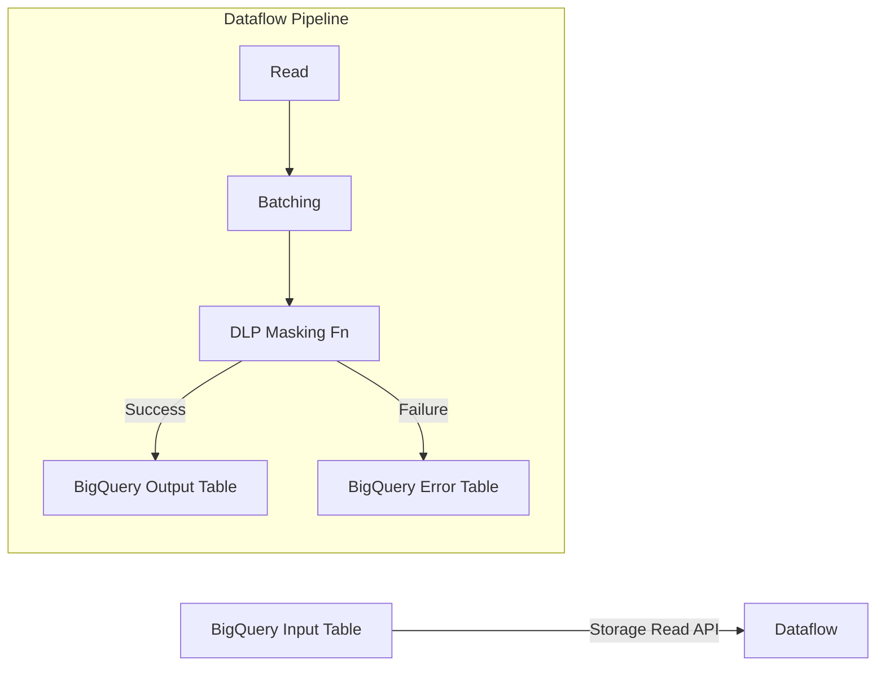

# Dataflow DLP PII Masking Pipeline

This project implements a secure and scalable Google Cloud Dataflow pipeline using Apache Beam (Java). It reads customer data from BigQuery, uses Google Cloud DLP (Data Loss Prevention) to detect and de-identify PII (Personally Identifiable Information), and writes the masked results back to BigQuery.

## 🚀 Features

*   **Scalable Processing**: Built on Apache Beam 2.69.0 and executed on Google Cloud Dataflow.
*   **PII Masking**: Integrated with Google Cloud DLP API.
    *   **Korean RRN**: Masks the last 7 digits (e.g., `123456-*******`).
    *   **Phone Numbers**: Masks the last 4 digits (e.g., `010-1234-****`).
*   **High Performance**: Uses BigQuery Storage Read/Write APIs for efficient I/O.
*   **Robustness**:
    *   **Dead Letter Queue (DLQ)**: Failed rows are captured in a separate error table (e.g., `_error` suffix) instead of failing the pipeline.
    *   **Metrics**: Custom counters to track processed rows, failed rows, and DLP API calls.

## ARCHITECTURE



## 🛠 Prerequisites

*   **Google Cloud Project**: With Dataflow, BigQuery, and DLP APIs enabled.
*   **Java 25**: Required for Dataflow worker compatibility (LTS).
*   **Maven**: For building the project.
*   **GCP Credentials**: `gcloud auth application-default login` configured.

## ⚙️ Configuration

The pipeline is configured via command-line arguments. Key parameters include:

*   `--project`: GCP Project ID.
*   `--region`: Dataflow region (e.g., `asia-northeast3`).
*   `--inputTable`: BigQuery source table (`project:dataset.table`).
*   `--outputTable`: BigQuery destination table.
*   `--network` / `--subnetwork`: VPC network configuration (essential for private workers).

## 🏃‍♂️ How to Run

A wrapper script `run_pipeline.sh` is provided to simplify building and submitting the job.

1.  **Configure Environment**:
    Edit `run_pipeline.sh` or set environment variables for your project:
    ```bash
    export PROJECT_ID="your-project-id"
    export REGION="your-region"
    export INPUT_TABLE="your-dataset.input_table"
    export OUTPUT_TABLE="your-dataset.output_table"
    ```

2.  **Execute**:
    ```bash
    bash run_pipeline.sh
    ```

    This command will:
    *   Compile the project using Maven (Creating a fat JAR).
    *   Exclude signature files to prevent runtime security errors.
    *   Submit the job to Dataflow.

## 🔍 DLP Logic Details

The masking logic is implemented in `DlpMaskingFn.java`.

### 1. RRN (Resident Registration Number)
*   **InfoType**: `KOREA_RRN`
*   **Detection**: Uses DLP's native detection with `Likelihood.POSSIBLE` to capture a wide range of formats.
*   **Transformation**: Character mask `*` on the **last 7 digits** in reverse order.

### 2. Phone Number
*   **InfoType**: `PHONE_NUMBER`
*   **Detection**: Standard phone number patterns.
*   **Transformation**: Character mask `*` on the **last 4 digits**.

## 📊 Monitoring

You can monitor the job in the [Google Cloud Dataflow Console](https://console.cloud.google.com/dataflow).

**Custom Metrics**:
*   `rowsProcessed`: Number of rows successfully masked.
*   `rowsFailed`: Number of rows that failed processing (sent to DLQ).
*   `dlpApiCalls`: Total number of requests sent to the DLP API.

## 🐛 Troubleshooting

*   **Network Errors**: Ensure `--network` and `--subnetwork` match your VPC settings.
*   **Java Version**: If workers fail to start, verify `pom.xml` targets Java 25 (`<maven.compiler.target>25</maven.compiler.target>`).
*   **SecurityException**: If `Invalid signature file digest` occurs, ensure `META-INF/*.SF` files are excluded in the shade plugin configuration.
